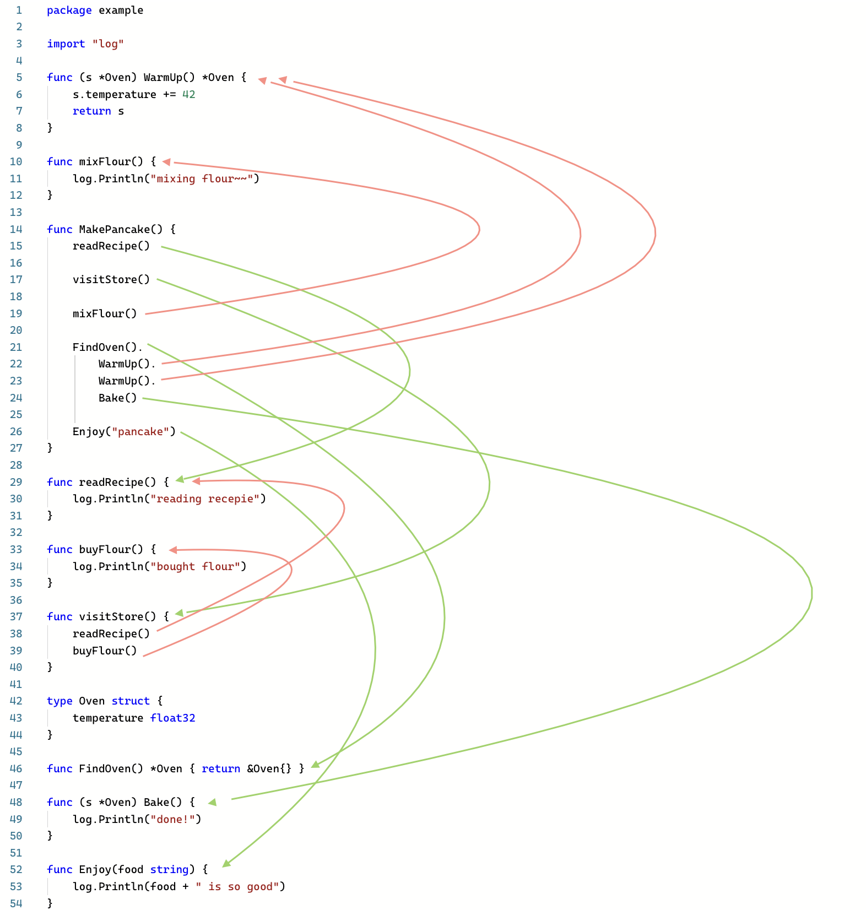
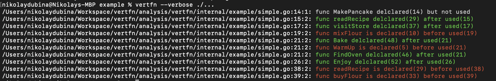

## refdir — Go linter that can enforce reference-based ordering of definitions in a file

[](https://goreportcard.com/report/github.com/devnev/refdir)

This linter was start as a fork from the [vertfn linter by
@nikolaydubina](https://github.com/nikolaydubina/vertfn). However it is a
significant departure in scope from that linter.

> _Disclaimer: false positives; practically this is useful for "exploration" rather than for "enforcement"_

> **Vertical Ordering**   
> In general we want function call dependencies to point in the downward direction. That is, a function that is called should be bellow a function that does the calling. This creates a nice flow down the source code module from the high level to low level.
> As in newspaper articles, we expect the most important concepts to come first, and we expect them to be expressed with the least amount of polluting detail. We expect the low-level details to come last. This allows us to skim source files, getting the gist from the frist few functions, without having to immerge ourselves in the details.  
> — Clean Code, Chapter 5, p84, Robert C. Martin, 2009



```go
go install github.com/devnev/refdir@latest
```

```bash
refdir --verbose ./...
```


